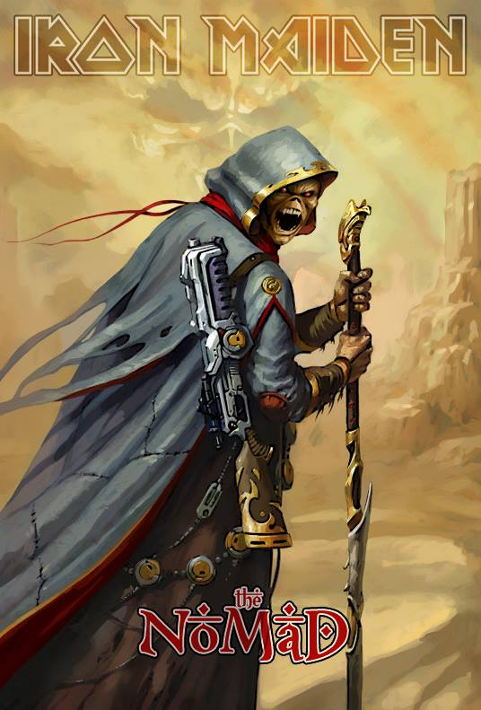
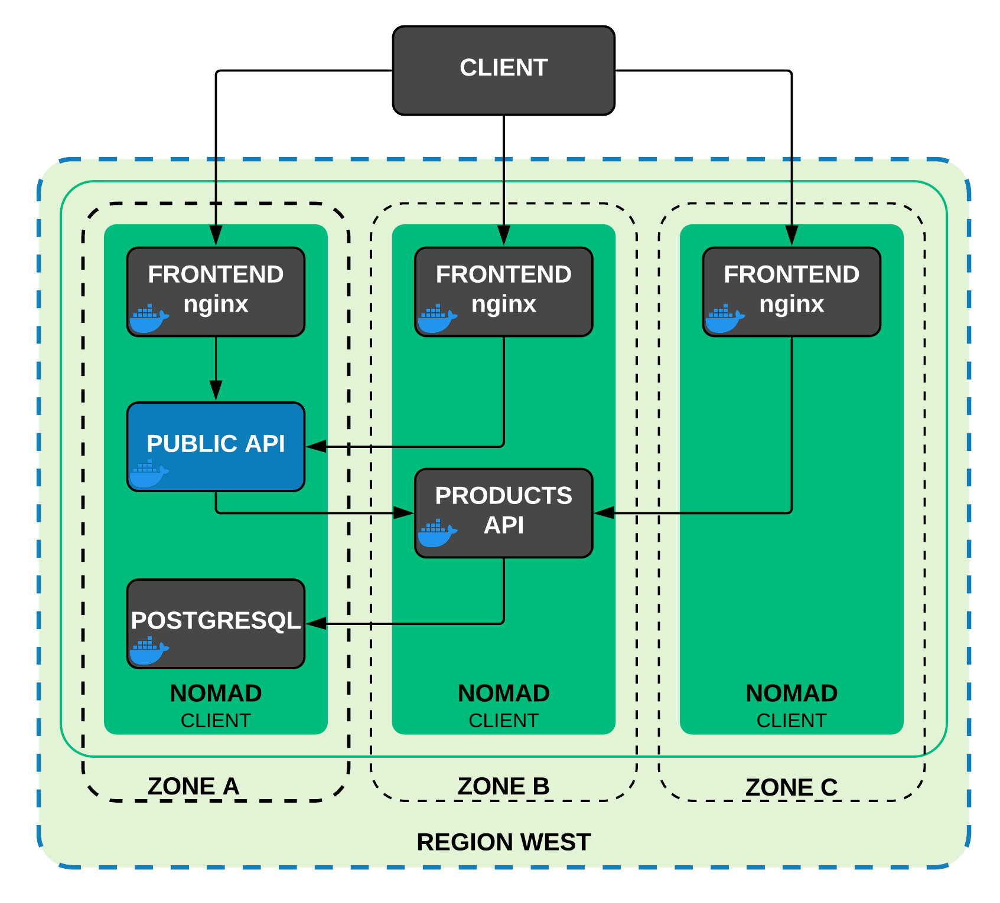
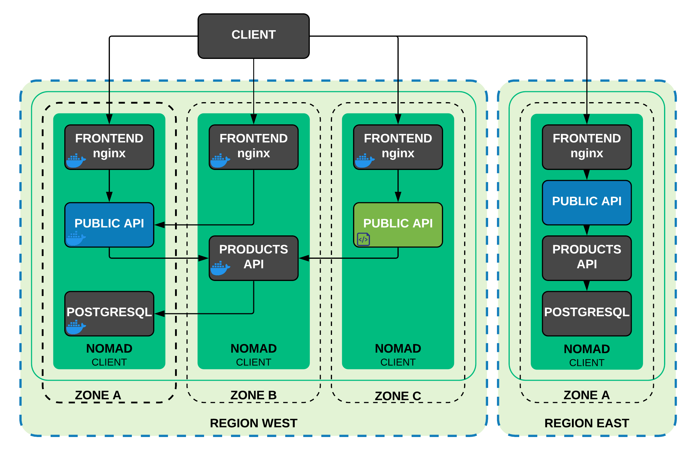
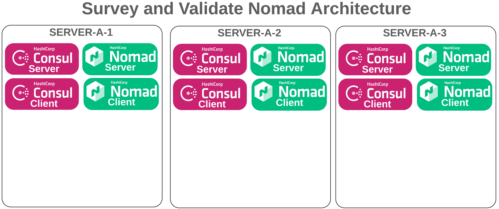
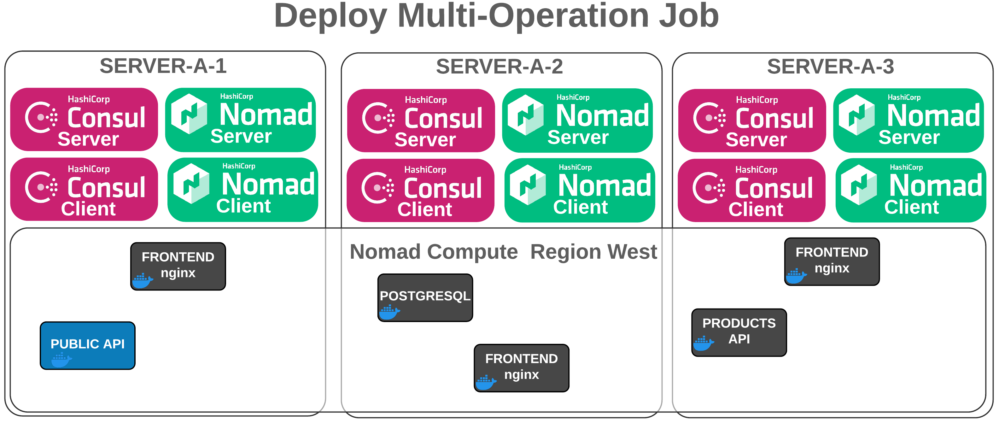
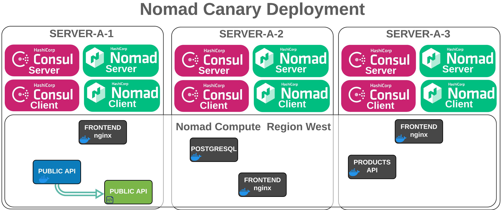

name: nomad-devops-drifters-land
class: title, shelf, no-footer, fullbleed
background-image: url(https://hashicorp.github.io/field-workshops-assets/assets/bkgs/HashiCorp-Title-bkg.jpeg)
count: false

# Nomad DevOps Drifters Land Demo
## Nomadically Drifting with our HashiCups

???
* Slide deck for the Nomad DevOps Drifters Land Demo
* SE Demo Hackathon 2020

---
layout: true

.footer[
- Copyright © 2020 HashiCorp
- 
]

---
class: img-right
name: Introductions
# The DevOps Drifters

.center[]

* Jason McCoy
* Jonathan Vermeulen
* Peter Phan
* Andy James
* Rob Jackson

???
* Introducing the DevOps Drifters team and our Mascot, Eddie

---
class: col-2
name: current-state
# HashiCups - Locked Into Containers

.center[]
.smaller[
  Team discovered HashiCups, a set of containers enabling us to sell coffee.  However...

* HashiCups is 100% Container Based
* Public API Function Needs Modification
* Management need us to expand across regions
]
.center[]

???
Currently we are using an application to sell a lifesaving drug - caffeine.  The application is called 'HashiCups' and we found it on Github somewhere. Unfortunately we didn't find any working cloud access keys, the developers must have been using Vault.

The challenge we are having is that although we saved a ton of money finding this application, it's all container based, and we aren't container specialists.  If we could just use the application as is, that wouldn't be a problem, but we need to modify the Public API functionality for our needs.

Also, management has pushed us for world domination, so we'll have to get the application working in another region without having to manage multiple databases and synchronization.  Oh my oh my what is an engineer to do?

---
class: col-2
name: end-state
# HashiCups - FREEDOM

.center[]
.smaller[
  Through Nomad, we are able to foster an infrastructure that enables more freedom and flexibility...
  * Increase Utilization Efficencies
  * Reduce Operational Overhead AND accelerate time to market
  * Run multiple types of workloads seamlessly - no need to containerize
  * Safely expand and update with blue-green deployments
]
???
Through Nomad, we are able to foster an infrastructure that enables more freedom and flexibility.  At the surface this may appear to just make the lives of the engineers better, but there is so much more.  The overall business can benefit greatly through...
* More efficient hardware utilization through Nomad Jobs
* Reduction in operational overhead AND accelerate time to market - no longer need to convert to containers just for the sake of container
* Safely switch over to new or upgraded components using canary deployments, within or across regions

---
class: compact, small
name:  business-validation
# Nomad Business Validation Matrix

<table class="tg" style="undefined;table-layout: fixed; width: 804px">
<colgroup>
<col style="width: 201px">
<col style="width: 201px">
<col style="width: 201px">
<col style="width: 201px">
</colgroup>
<thead>
  <tr>
    <th class="tg-umgj">Topic/Test Case</th>
    <th class="tg-umgj" colspan="3">Business Outcome</th>
  </tr>
</thead>
<tbody>
  <tr>
    <td class="tg-j95b">Nomad Concepts and Architecture</td>
    <td class="tg-j95b">Increase Hardware Utilization Efficiency</td>
    <td class="tg-j95b">Reduce Operational Overhead</td>
    <td class="tg-j95b">Accelerate Time to Market</td>
  </tr>
  <tr>
    <td class="tg-lcl0">Interact Using CLI and UI</td>
    <td class="tg-lcl0"></td>
    <td class="tg-lcl0">Reduce Operational Overhead</td>
    <td class="tg-lcl0">Accelerate Time to Market</td>
  </tr>
  <tr>
    <td class="tg-j95b">Create, Run and Modify Jobs</td>
    <td class="tg-j95b">Increase Hardware Utilization Efficiency</td>
    <td class="tg-j95b">Reduce Operational Overhead</td>
    <td class="tg-j95b">Accelerate Time to Market</td>
  </tr>
  <tr>
    <td class="tg-lcl0">Basic Job Specification</td>
    <td class="tg-lcl0">Increase Hardware Utilization Efficiency</td>
    <td class="tg-lcl0">Reduce Operational Overhead</td>
    <td class="tg-lcl0">Accelerate Time to Market</td>
  </tr>
  <tr>
    <td class="tg-j95b">Monitor Jobs and Allocations</td>
    <td class="tg-j95b"></td>
    <td class="tg-j95b">Reduce Operational Overhead</td>
    <td class="tg-j95b">Accelerate Time to Market</td>
  </tr>
  <tr>
    <td class="tg-lcl0">Deploy Mulit-Server Cluster</td>
    <td class="tg-lcl0">Increase Hardware Utilization Efficiency</td>
    <td class="tg-lcl0">Reduce Operational Overhead</td>
    <td class="tg-lcl0">Accelerate Time to Market</td>
  </tr>
  <tr>
    <td class="tg-j95b">Stateful Workloads with Host Volumes</td>
    <td class="tg-j95b">Increase Hardware Utilization Efficiency</td>
    <td class="tg-j95b">Reduce Operational Overhead</td>
    <td class="tg-j95b">Accelerate Time to Market</td>
  </tr>
</tbody>
</table>

???
Core benefits to the business
Increase Hardware utilization - not really in this demo
Reduce Operational Overhead - same process containers or not
Accelerate time to market - no need to containerize
Stateful workloads for Postgres
Deploy secure applications - not really in this demo

.smaller[
| Business Outcome | Workflow Change/Test Case |Workflow Change/Test Case | Workflow Change/Test Case | Workflow Change/Test Case |Workflow Change/Test Case| Workflow Change/Test Case|
|-----------------------------|--------------------|---------|---------|---------|---------|---------|
| Increase Hardware Utilization Efficiency | Nomad Concepts and Architecture | | Create, Run and Modify Jobs | Basic Job Specification || Deploy Mulit-Server Cluster|
| Reduce Operational Overhead | Nomad Concepts and Architecture | Interact Using CLI and UI | Create, Run and Modify Jobs | Basic Job Specification |Monitor Jobs and Allocations| Deploy Mulit-Server Cluster|
| Accelerate Time to Market | Nomad Concepts and Architecture | | Create, Run and Modify Jobs | Basic Job Specification || Deploy Mulit-Server Cluster|
| Reduce Operational Overhead | Nomad Concepts and Architecture | Interact Using CLI and UI | Create, Run and Modify Jobs | Basic Job Specification |Monitor Jobs and Allocations| Deploy Mulit-Server Cluster|
]

---
class:
name: Challenge_1_NomadArchitecture
# Challenge 1 Nomad Architecture

.center[]

---
class:
name: Challenge_2_MultiOperationJob
# Challenge 2 Multi-Operation Job

.center[]

---
class:
name: Challenge_3_NomadCanary
# Challenge 3 Promote Nomad Canary

.center[]

---
class:
name: Challenge_4_TwoNomadClusters
# Challenge 4 Utilizing Two Nomad Clusters

.center[]
